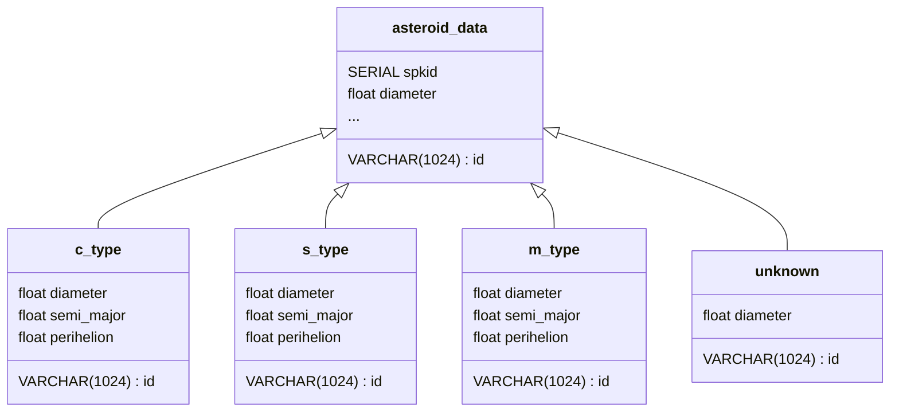

# AsteroidMining
Report on the viability of asteroid mining. [Report can be found here](https://github.com/jmcbee-dev/AsteroidMining/blob/main/AsteroidMiningReport.pdf)

Data was sourced from https://www.kaggle.com/sakhawat18/asteroid-dataset

# Running Locally
On a local database, run the init.sql script while copying the data over. Typically this can be done by running the following in an SQL session

`\copy aseteroid_data from dataset.csv csv header;`

The resulting schema will look as such

Following this run the `data_collecting.sql` within an SQL session to the parse the data into sample analytics.

Further analysis and plotting of the data is done with a python file located in the charts directory.
