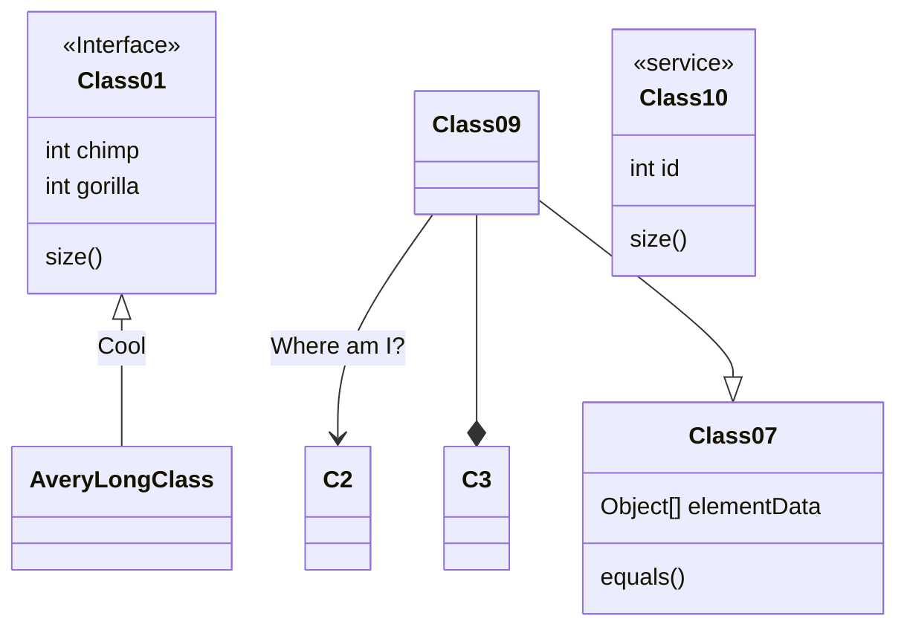

# AsteroidMining
Report on the viability of asteroid mining. 

Data was sourced from https://www.kaggle.com/sakhawat18/asteroid-dataset

# Running Locally
On a local database, run the init.sql script while copying the data over. Typically this can be done by running the following in an SQL session

`\copy aseteroid_data from dataset.csv csv header;`

The resulting schema will look like such

